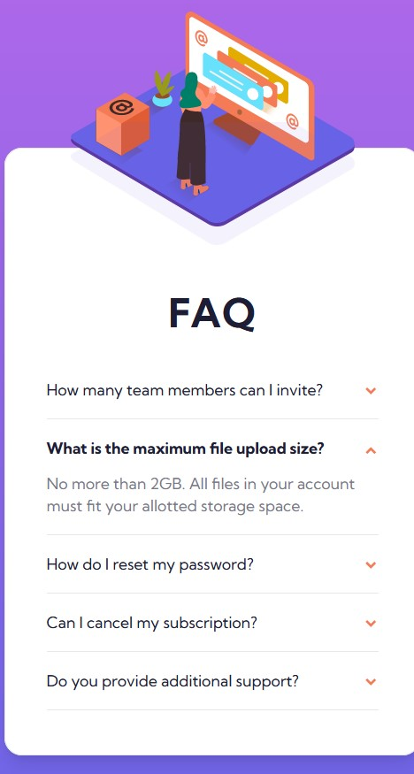

# Frontend Mentor - FAQ accordion card solution

This is a solution to the [FAQ accordion card challenge on Frontend Mentor](https://www.frontendmentor.io/challenges/faq-accordion-card-XlyjD0Oam). Frontend Mentor challenges help you improve your coding skills by building realistic projects.

## Table of contents

- [Overview](#overview)
  - [The challenge](#the-challenge)
  - [Screenshot](#screenshot)
  - [Links](#links)
- [My process](#my-process)
  - [Built with](#built-with)
  - [Continued development](#continued-development)
  - [Useful resources](#useful-resources)
- [Author](#author)
- [Acknowledgments](#acknowledgments)

## Overview

### The challenge

Users should be able to:

- View the optimal layout for the component depending on their device's screen size
- See hover states for all interactive elements on the page
- Hide/Show the answer to a question when the question is clicked

### Screenshot

- Desktop version.
  

- Mobile version.
  

### Links

- Solution URL: [Source code on Github](https://github.com/Abaljerind/faq-accordion-card)
- Live Site URL: [Product Preview Card Component](https://faq-accordion-card-abaljerind.vercel.app/)

## My process

### Built with

- Semantic HTML5 markup
- [TailwindCSS](https://tailwindcss.com/) - For styles
- [Jquery](https://api.jquery.com/) - For javascript library

### Continued development

For future development, i got several things below:

- For the images (illustration and the pattern in desktop devices), to be honest, i'm stuck and really stuck at this one, i couldn't change it like the design, so maybe in the future if i can finally know how to do it, i would love to fix it.
- In the javascript code, i would love to make it when the arrow clicked, the answer doesn't take space so the height would be still the same.
- Also in javascript code, i would love to make it when 1 arrow clicked, the other arrow and the answer would close automatically.

### Useful resources

- [TailwindCSS](https://tailwindcss.com/) - This helped me to do the styling more easy. I really liked this tailwind css and will use it going forward.
- [Vercel](https://vercel.com) - This is an amazing website which helped me to upload my website into the internet. I'd recommend it to anyone still learning to use this website.
- [Jquery](https://api.jquery.com/) - This helped me to code with javascript more less and easy, well i still got a lot to learn and there's no perfect time to do it than right now.

## Author

- Website - [AbalJerind](https://faq-accordion-card-abaljerind.vercel.app/)
- Frontend Mentor - [@Abaljerind](https://www.frontendmentor.io/profile/Abaljerind)

## Acknowledgments

I want to thank me for believing in me, I want to thank me for doing all this hard work. I wanna thank me for having no days off. I wanna thank me for never quitting. I wanna thank me for being me at all times.
